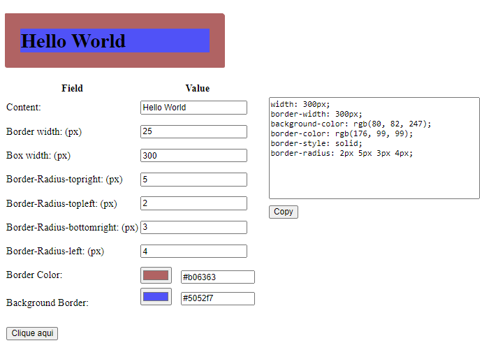

# Tool for border-radius

 <a href="#demonstracao">Demostração</a> •
 <a href="#objetivo">Objetivo</a> •
 <a href="#tecnologias">Tecnologias</a> •  
 <a href="#status">Status</a> •
 <a href="#melhorias">Melhorias</a> •  
 <a href="#autor">Autor</a> • 
 <a href="#licenca">Licença</a>

### Demostração

### Objetivo
#### O projeto visa ajudar os desenvolvedores em criar elementos com configurações de bordas e cores antes de aplicar no projeto.

&nbsp;

### Tecnologias

- HTML
- CSS
- JavaScript

&nbsp;

### Status

#### Em andamento
&nbsp;

### Melhorias

* Possível selecionar qual unidade de medida quer usar: px ou rem (muito usado em frameworks)
* Seleção de diferentes estilos de bordas para melhores simulações

&nbsp;

### Autor

#### Anderson da Silva Costa
[Rocketseat](https://app.rocketseat.com.br/me/andgtsc-1607559111333) 

[Linkedin](https://www.linkedin.com/in/anderson-costa-7a15141b2/)

&nbsp;

<h3 id="licenca">Licença</h3>

#### MIT License Copyright (c) 2021 [Anderson Costa ](https://github.com/Mert1s)

